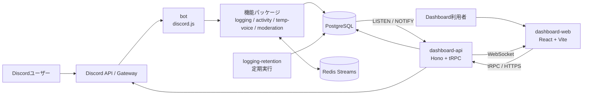

# システム全体構成

## 目的

Management Bot を構成するプロセスと外部サービスの境界を示す。

## プロセスの責務

| プロセス | 主な責務 |
|---|---|
| `apps/bot` | Discord Gatewayへ接続し、ギルド初期化と機能モジュールの起動を行う。 |
| `apps/dashboard-api` | ログイン、セッション、tRPC API、WebSocket、Discord情報の取得を提供する。 |
| `apps/dashboard-web` | 管理画面。APIから取得したデータを権限に応じて表示する。 |
| `apps/logging-retention` | ログ保持期間に従い、期限切れログを削除する。 |
| PostgreSQL | ギルド設定、セッション、権限付与、ログ、各機能の永続データを保持する。 |
| Redis Streams | 機能パッケージ間のドメインイベントを疎結合に中継する。 |

