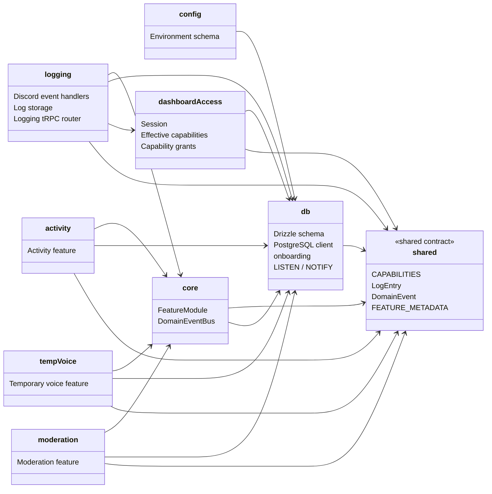

# パッケージ依存と責務

## 目的

共有基盤と機能パッケージの依存方向を示す。機能間の通知は直接importではなく Redis Streams のドメインイベントを使う。

## 境界

| パッケージ | 責務 | 他機能との関わり |
|---|---|---|
| `shared` | capability、ドメイン型、イベント契約、機能メタデータ | 全パッケージが参照する共通契約。 |
| `config` | 環境変数の検証 | アプリ起動時の設定入力を限定する。 |
| `db` | スキーマ、DB接続、ギルド初期化、通知リスナー | 永続化の唯一の入口。 |
| `core` | 機能モジュールの起動契約、Redis Streamsイベントバス | 機能間連携の基盤。 |
| `dashboard-access` | セッションと実効権限 | Dashboard APIの認証・認可を提供する。 |
| `logging` | Discordイベントの正規化、ログ保存・閲覧 | moderationイベントも購読してログ化する。 |
| `activity` / `temp-voice` / `moderation` | 個別のBot機能 | `FeatureModule`としてBotへ登録される。 |

