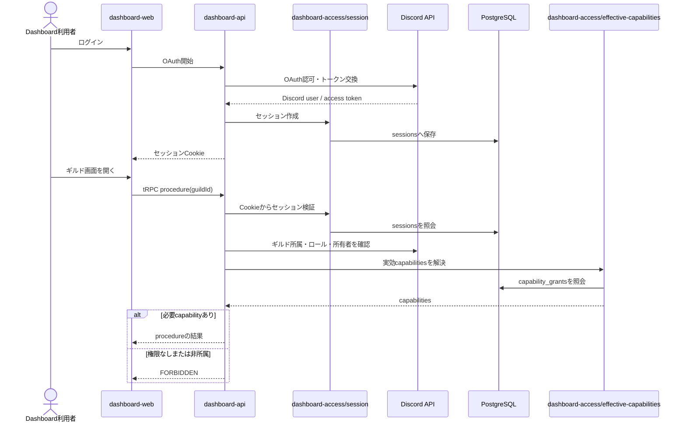
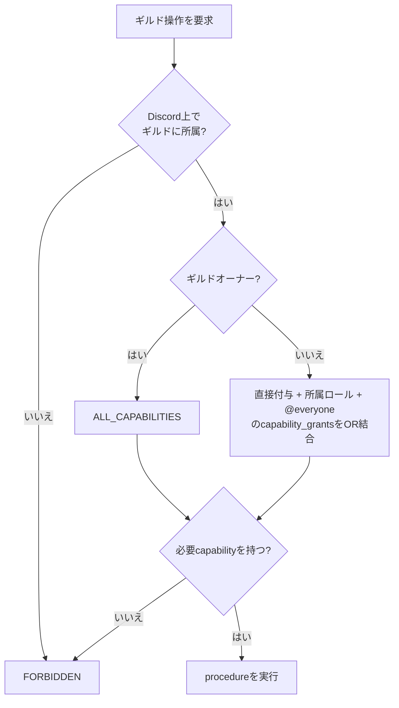

# 認証・認可フロー

## 目的

Dashboardのログインから、ギルド単位の実効権限を使ったAPI認可までを示す。

## 実効権限の規則

## ログ閲覧の追加規則

| 権限 | 許可される内容 |
|---|---|
| `VIEW_LOGS` | ログの要約、現在本文 `content`、整形済み差分。 |
| `VIEW_LOGS_RAW` | 上記に加え、編集前本文 `previousContent` と保存payloadの「生データ」展開欄。 |

