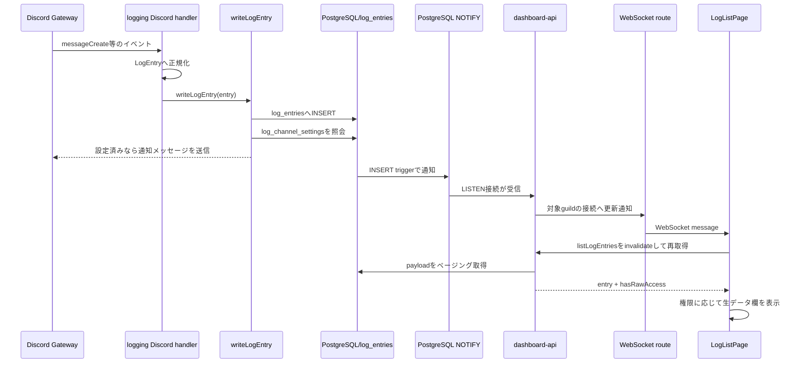
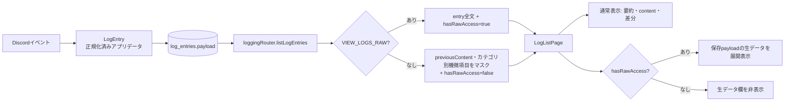

# ログイベントの保存・配信・表示フロー

## 目的

Discordイベントがログとして保存され、Dashboardにリアルタイム表示されるまでを示す。

```mermaid
sequenceDiagram
  participant Discord as Discord Gateway
  participant Handler as logging Discord handler
  participant App as writeLogEntry
  participant DB as PostgreSQL/log_entries
  participant Notify as PostgreSQL NOTIFY
  participant API as dashboard-api
  participant WS as WebSocket route
  participant Web as LogListPage

  Discord->>Handler: messageCreate等のイベント
  Handler->>Handler: LogEntryへ正規化
  Handler->>App: writeLogEntry(entry)
  App->>DB: log_entriesへINSERT
  App->>DB: log_channel_settingsを照会
  App-->>Discord: 設定済みなら通知メッセージを送信
  DB->>Notify: INSERT triggerで通知
  Notify->>API: LISTEN接続が受信
  API->>WS: 対象guildの接続へ更新通知
  WS->>Web: WebSocket message
  Web->>API: listLogEntriesをinvalidateして再取得
  API->>DB: payloadをページング取得
  API-->>Web: entry + hasRawAccess
  Web->>Web: 権限に応じて生データ欄を表示
```

## ログデータの境界

```mermaid
flowchart LR
  Event[Discordイベント] --> Normalized[LogEntry\n正規化済みアプリデータ]
  Normalized --> Stored[(log_entries.payload)]
  Stored --> Router[loggingRouter.listLogEntries]
  Router --> Raw{VIEW_LOGS_RAW?}
  Raw -->|あり| Full[entry全文 + hasRawAccess=true]
  Raw -->|なし| Mask[previousContent・カテゴリ別機微項目をマスク\n+ hasRawAccess=false]
  Full --> Page[LogListPage]
  Mask --> Page
  Page --> View[通常表示: 要約・content・差分]
  Page --> Detail{hasRawAccess?}
  Detail -->|あり| RawView[保存payloadの生データを展開表示]
  Detail -->|なし| Hidden[生データ欄を非表示]
```

`payload` はDiscord Gatewayの生イベント全体ではない。画面表示と検索に必要な情報へ正規化した `LogEntry` を保存している。
