# データベースER図

## 目的

PostgreSQLに永続化するテーブル、主キー、外部キーを示す。Discordのユーザー・ロール・チャンネルは外部サービスのIDとしてテキスト列へ保持し、ローカルテーブルとしては管理しない。

```mermaid
erDiagram
  guilds {
    text id PK "Discord Guild ID"
    text name
    timestamptz created_at
    timestamptz updated_at
  }

  guild_configs {
    text guild_id PK, FK
    jsonb config
    timestamptz created_at
    timestamptz updated_at
  }

  dashboard_access_grants {
    text id PK
    text guild_id FK
    text discord_user_id "Discord external ID"
    timestamptz created_at
  }

  capability_grants {
    text id PK
    text guild_id FK
    text target_type "user | role"
    text target_id "Discord external ID"
    int capabilities "bit mask"
    timestamptz created_at
  }

  sessions {
    text id PK
    text discord_user_id "Discord external ID"
    text discord_username
    text encrypted_access_token
    text encrypted_refresh_token
    timestamptz expires_at
    timestamptz created_at
  }

  features {
    text key PK
    text name
    text description
  }

  guild_feature_toggles {
    text guild_id PK, FK
    text feature_key PK, FK
    boolean enabled
  }

  log_entries {
    text id PK
    text guild_id FK
    text category
    boolean author_is_bot
    jsonb payload
    timestamptz created_at
  }

  log_retention_settings {
    text guild_id PK, FK
    text category PK
    int retention_days
  }

  log_channel_settings {
    text guild_id PK, FK
    text category PK
    text channel_id "Discord external ID"
  }

  log_display_settings {
    text guild_id PK, FK
    boolean hide_audit_log_correlation
    boolean hide_bot_events
  }

  guilds ||--o| guild_configs : has
  guilds ||--o{ dashboard_access_grants : has
  guilds ||--o{ capability_grants : grants
  guilds ||--o{ guild_feature_toggles : configures
  features ||--o{ guild_feature_toggles : enabled_for
  guilds ||--o{ log_entries : owns
  guilds ||--o{ log_retention_settings : retains
  guilds ||--o{ log_channel_settings : routes
  guilds ||--o| log_display_settings : displays
```

## テーブルの役割

| 領域 | テーブル | 役割 |
|---|---|---|
| ギルド基盤 | `guilds` | 全設定・ログの親。Discord guild IDを主キーにする。 |
| ギルド基盤 | `guild_configs` | ギルド共通のJSON設定。ギルドごとに最大1行。 |
| 認証 | `sessions` | Dashboard OAuthセッションと暗号化済みトークン。`discord_user_id`は外部ID。 |
| 認可 | `capability_grants` | ユーザー・ロール・`@everyone`へのcapabilityビットマスク付与。 |
| 認可 | `dashboard_access_grants` | Dashboardアクセス許可のレコード。 |
| 機能 | `features` | 機能メタデータのマスター。 |
| 機能 | `guild_feature_toggles` | ギルド単位の機能ON/OFF。`guild_id + feature_key`が複合主キー。 |
| ログ | `log_entries` | 正規化済みのログpayload。ギルド・カテゴリ・時刻で検索する。 |
| ログ | `log_retention_settings` | カテゴリ別の保持日数。`guild_id + category`が複合主キー。 |
| ログ | `log_channel_settings` | カテゴリ別のDiscord通知チャンネル。`guild_id + category`が複合主キー。 |
| ログ | `log_display_settings` | ログ一覧の表示フィルタ。ギルドごとに最大1行。 |

## 外部IDと参照整合性

DBが外部キーで整合性を保証するのは、ローカルに永続化する `guilds` と `features` のみである。`discord_user_id`、`target_id`、`channel_id` はDiscord上の実体を表す外部IDであり、Discord APIへの照会時に存在・所属を検証する。

`guilds` を削除すると、ギルドに属する設定、権限付与、ログはすべて `ON DELETE CASCADE` で削除される。
