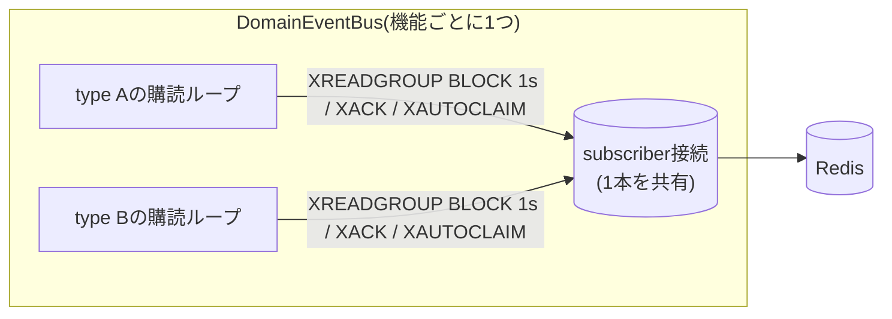
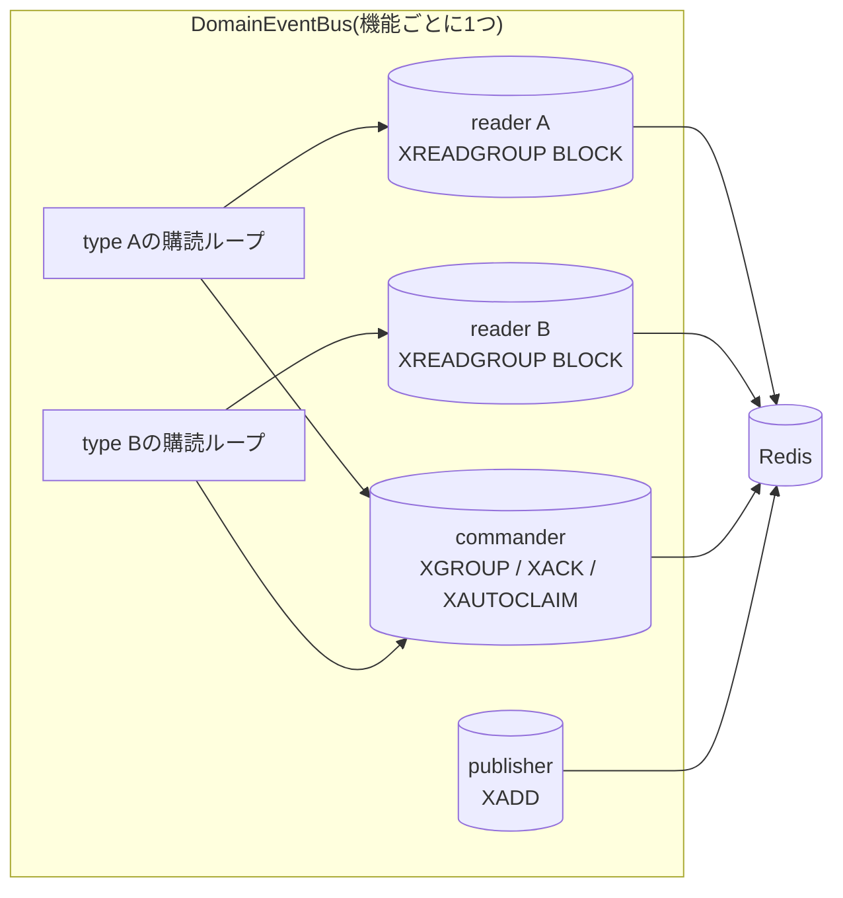

# ドメインイベントバスの購読並行性

## 目的

`packages/core/src/domain-events-bus.ts`(`DomainEventBus`)が、購読するイベントtypeが増えたときにどう遅くなるかを整理し、対応方針を決める(#423)。

> 以下の「現状の仕組み」〜「既存機能への影響」は#423での検討時点(対応前)の内容。実際の対応は末尾の「実装結果(#465)」を参照。

## 現状の仕組み

- `apps/bot`は機能(`FEATURES`)ごとに`DomainEventBus`を1つ作る。consumer groupは機能キーと同じ名前になる。
- 1つのバスの中では、購読するtypeごとに購読ループが動く。ただし**Redis接続(subscriber)は全ループで1本を共有**している。
- Redisは1本の接続のコマンドを順番に処理する。`XREADGROUP ... BLOCK 1000`が待機している間は、同じ接続に送られた他のコマンド(別typeの`XREADGROUP`、`XACK`、`XAUTOCLAIM`)は後ろで待たされる。

### 遅延の見積もり

1つのバスがN個のtypeを購読すると、イベントが来ていないtypeのBLOCK(最大1秒)がN-1個ぶん前に並ぶことがある。

| 1バスあたりの購読type数 | 新着イベントを読むまでの最悪の待ち | XACKの最悪の待ち |
|---|---|---|
| 1 | 約0秒(自分のBLOCKだけ) | 約0秒 |
| 2 | 約1秒 | 約1秒 |
| N | 約(N-1)秒 | 約(N-1)秒 |

XACKが遅れても、配送が抜けたり重複したりはしない(at-least-onceの性質は変わらない)。影響があるのは「反映が遅れる」ことだけ。

### 現在の購読状況(2026-09時点)

| 機能(consumer group) | 購読type | 数 |
|---|---|---|
| logging | `moderation.action.recorded`, `temp-voice.event.recorded` | 2 |
| activity / temp-voice / moderation | なし(temp-voice・moderationはpublishのみ) | 0 |

一時VC機能(#405)でloggingが`temp-voice.event.recorded`も購読するようになったため、**loggingのバスでは直列化による遅延がすでに起こりうる**。
片方のtypeにイベントが来ていない間は、そのBLOCK(最大1秒)の後ろにもう片方の読み取り・XACKが並ぶので、moderation・一時VCのログ通知が最大で約1秒遅れる。
ログ通知の用途では1秒程度の遅れは許容範囲だが、購読typeがさらに増えるとそのぶん遅れが伸びる。

## 問題になるタイミング

「**1つの機能が2つ以上のtypeを購読したとき**」に遅延が出る。type全体の数が増えるだけでは問題にならない(機能ごとにバスと接続が分かれているため)。

- loggingは上記のとおりすでに該当している(2type)。
- 今後、loggingが3つ目のtypeを購読する、またはactivityが`voice.session.ended`に加えて別のtypeも購読すると、遅れがさらに伸びる。

## 対応案の比較

| 案 | 内容 | よい点 | 気になる点 |
|---|---|---|---|
| A. 1回のXREADGROUPで複数streamを読む | `XREADGROUP ... STREAMS s1 s2 ... > >`で全typeを1回のBLOCKで待つ | 接続数が増えない。typeが増えても待ちは1回ぶん(最大1秒)のまま | 購読ループの作り直しが必要(読み取りを1本に集約し、type別に振り分ける)。XACK/XAUTOCLAIMもBLOCKの後ろに並ぶ点は残る |
| B. typeごとに専用接続 | `subscribe`のたびに`XREADGROUP`用の接続を1本作る | 変更が小さい(接続を分けるだけ) | 接続数が「機能数×type数」に増える。Redisの接続上限・メモリを消費する |
| C. BLOCK用とXACK用の接続を分ける | XACK/XAUTOCLAIMを別接続で送る | XACKの遅れがなくなる | それだけでは読み取りの直列化は解消しない。A・Bと組み合わせる前提 |

## 方針

- **案A + 案Cを合わせた実装issueを起票し、早めに対応する**。loggingがすでに2typeを購読していて遅れが出うるため。
  - 最大約1秒の遅れはログ通知としては許容範囲なので、緊急対応はしない。
  - 遅くとも、いずれかの機能が3つ目のtypeを購読するPRより前に入れる。
  - 案Aで、typeが増えても読み取りの待ちを最大1回ぶんに抑える。
  - 案Cで、XACK・XAUTOCLAIMがBLOCKの後ろに並ばないようにする(接続は1バスあたり2本で固定)。
- `DomainEventBus`の公開API(`publish`/`subscribe`/`close`)とconsumer group名は変えない。そのため、logging・moderationのハンドラ側の変更は不要で、未ACKのエントリ(PEL)もそのまま引き継がれる。
- 移行はバス内部だけで完結するので、機能ごとに段階的に切り替える必要はない。

## 既存機能への影響

- logging: ハンドラ(`handleModerationEvent`・`handleTempVoiceEvent`)の変更は不要。遅れが最大約1秒からほぼ0になる。
- moderation・temp-voice: publishのみなので影響なし。
- テスト: `domain-events-bus.test.ts`の「複数typeを購読したとき、片方のBLOCK中でももう片方のイベントが1秒以内に届く」ケースを、実装時に追加する。

## 実装結果(#465)

実装時に方針を見直し、**案A + 案C ではなく、案B + 案C** を採用した。

### 案Aをやめた理由

- 案Aは読み取りを1本のループにまとめるため、全typeのhandlerも1本のループで順番に実行することになる。
- handlerはDB書き込みやDiscordへのメッセージ送信を行い、レート制限に当たると数秒かかることもある。1つのtypeのhandlerが遅いと、他のtypeの配送まで止まってしまう。
- 従来はtypeごとにループが分かれていて、handlerの遅さが他typeへ波及しなかった。この性質を失いたくなかった。

### 案Bの接続数

- 1バスあたりの接続数は「publisher 1 + commander 1 + 購読type数」。
- 現状はbot全体でも10本程度(4機能 × publisher/commander の2本 + loggingの購読2type)で、Redisの接続上限(既定10000)に対して十分小さい。

### 確認したこと

- 2typeを購読し、片方にイベントを流さずBLOCKさせたまま、もう片方へ5回publishして、配送の遅れが最大でも500ms未満であることをテストで確認した。
- 変更前の実装(1本の接続を共有)では、同じテストが失敗することを確認した。
