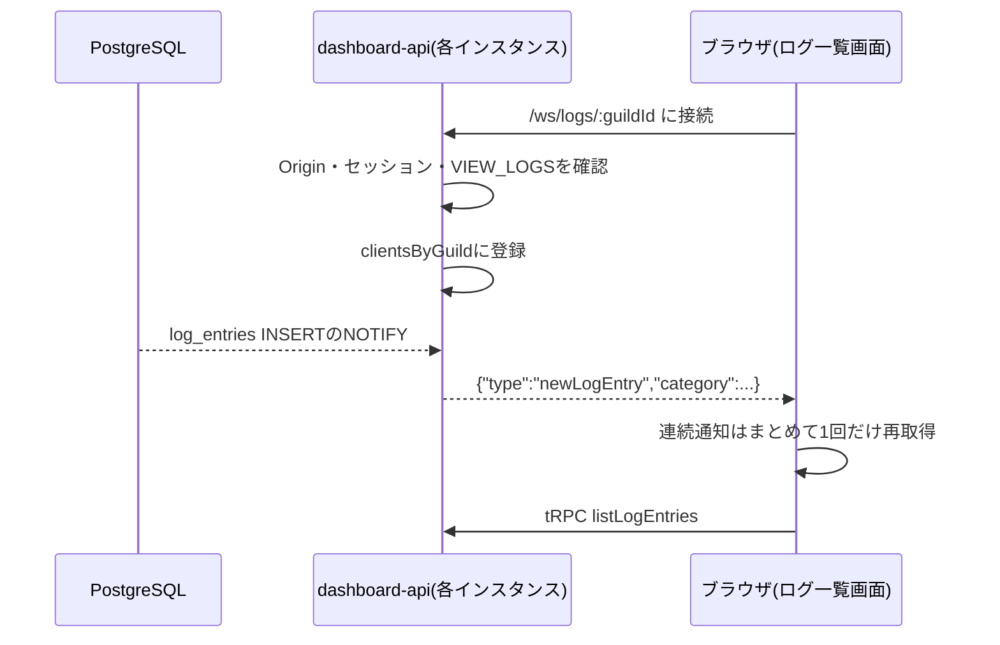

# ログ通知WebSocketの接続数とバックプレッシャー

## 目的

`apps/dashboard-api/src/ws/log-broadcaster.ts`のWebSocket配信について、接続数の上限とバックプレッシャー(送信が詰まったときの扱い)が必要かを判断する(#424)。

## 現状の仕組み

- 各インスタンスが自分でLISTENし、自分に接続しているブラウザにだけ送る。インスタンスを増やしてもそのまま動く。
- 送る内容は種類(category)だけで、1通あたり数十バイト。本文はtRPCで別に取りに行く。
- ブラウザ側(`LogListPage.tsx`)は、連続した通知を1回の再取得にまとめている。また、過去ページを見ている間は再取得しない。
- 送信に失敗した接続はその場で登録を外す。セッションの期限が来たら、サーバーから切断する(close code 4001)。

## 規模の見積もり

- 1接続を保つコストは、Bunのソケット1つとタイマー1つ程度(数KB)。1インスタンスで数千〜数万接続は余裕がある。
- 接続するのは「ログ一覧画面を開いている、VIEW_LOGS権限を持つ管理者」だけ。現在の想定(1Botが担当するギルド数が数百以下、1ギルドで同時に見る人は数人)では、**1インスタンスあたり多くても数百接続**になる。
- 通知は小さく、Bunは送信バッファがいっぱいでも既定では接続を切らずに溜める。数十バイトの通知が溜まってメモリを圧迫するには、極端に多い接続と極端に遅い相手が同時に必要になる。

## 本当に負荷がかかる場所

接続数そのものより、次の2つのほうが先に効いてくる。

1. **接続時の確認処理**: 接続のたびに、セッション確認・ギルド所属の確認(Discord API)・権限計算を行う。再接続が集中すると、ここにDBとDiscord APIの負荷がかかる。ただしブラウザ側は、ゆらぎ付きの指数バックオフで再接続し、6回失敗したら諦めるので、一斉再接続はある程度抑えられている。
2. **通知を受けた後の再取得**: 大きなギルドでログが大量に出ると、見ている人数ぶんtRPCの再取得が起きる。これはブラウザ側で連続通知を1回にまとめているため、1人あたりの回数は抑えられている。

## 方針

- **今は、接続数の上限もバックプレッシャー制御も実装しない**。見積もり上の接続数が小さく、通知も小さいので、今入れても得られるものが少ない。
- 次のどれかに当てはまったら、実装issueを起票する。
  - 1インスタンスの接続数が数千を超えそうになった(ギルド数や利用者が大きく増えた)。
  - 1人のユーザーが大量に接続を開く、といった不正な使い方が見つかった。
  - dashboard-apiのメモリ使用量が接続数に比例して増えていることが分かった。
- そのときに入れるもの(優先順):
  1. **1ユーザーあたりの同時接続数の上限**(例: 5本)。超えたら一番古い接続を切る。タブを多く開いた人が他の人に影響するのを防ぐ。
  2. **1インスタンスあたりの接続数の上限**(環境変数で設定)。超えたら新しい接続を「後でやり直して」(close code 1013)で断る。ブラウザ側の再接続バックオフがそのまま使える。
  3. **送信バッファが一定量を超えた接続は切る**。Bunの`backpressureLimit`・`closeOnBackpressureLimit`を設定する。
- **監視**: 現在の接続数を見る手段は今はない。上の条件に当てはまるかを判断するため、実装issueを起こす時点で、接続数を定期的にログへ出す(またはヘルスチェックで返す)ところから始める。
